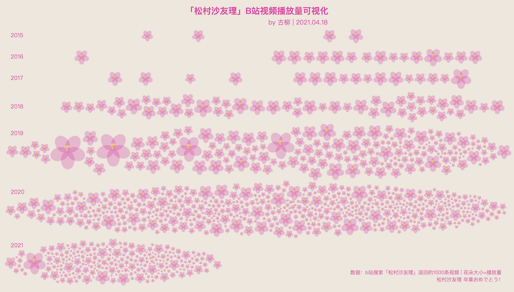

# dataviz-in-action
## 简介
本项目会针对某些优秀可视化作品进行翻新复现、代码实践，主要用到[d3.js](https://github.com/d3/d3)，考虑到难度不小，且时间精力有限，所以更新频率可能不会太快，争取一个月能啃掉一个项目。据古柳所知，还不曾有人做过这件事，可以期待一下！

另外，出于方便自己和大家多看优秀作品，多开眼，并且真正实践时可以找灵感，在模仿的基础上进行创新的目的，古柳会在此仓库[DesertsX/dataviz-collections](https://github.com/DesertsX/dataviz-collections)定期分享收藏的可视化相关的图或项目。

最后，可视化交流群欢迎👏大家加入，加古柳微信`「xiaoaizhj」`，备注「可视化加群」即可。

## 复现作品
### EP01: 财新网「星空彩绘诺贝尔奖」可视化作品
原作品链接：http://datanews.caixin.com/2013/nobel/index.html    
复现文章记述：[财新网「星空彩绘诺贝尔奖」可视化作品复现 - 古柳 - 牛衣古柳公众号](https://mp.weixin.qq.com/s/MY1GumgPWSktLbuw-lHH5Q)   
效果演示：https://desertsx.github.io/dataviz-in-action/01-caixin-nobel/index.html

### EP01.5: 「MeToomentum」可视化作品
`Valentina D'Efilippo` 和 `Lucia Kocincova` 的 `MeToomentum` 项目里的 `Trending seeds` 可视化作品。  
原作品链接：http://metoomentum.com/index.html    
复现文章记述：[MeToomentum 可视化作品复现系列文章(一) - 古柳 - 牛衣古柳公众号](https://mp.weixin.qq.com/s/Oq2Au6ygeDQWTiJ8mXywdA)    
该系列复现文章将继续更新，代码整理后也会开源，敬请期待。  

### EP02: Wendy Shijia 的「Escher's Gallery」可视化作品
原作是 `Wendy Shijia` 用 `Tableau` 所作，`古柳` 用 `D3.js` 进行复现。注：点击有颜色的区域会显示每部作品详细数据；点击其他区域会隐藏显示。    
原作品链接：[Tableau: Wendy Shijia/Escher's Gallery](https://public.tableau.com/profile/wendy.shijia#!/vizhome/MCEschersGallery_15982882031370/Gallery)    
相关推特：[@ShijiaWendy](https://twitter.com/ShijiaWendy/status/1297950623141203968)    
复现文章记述：[Wendy Shijia 的「 Escher's Gallery」可视化作品复现系列文章(一)](https://mp.weixin.qq.com/s/TyqFskD6R-kn3ToxfHVa9g)、[Wendy Shijia 的「 Escher's Gallery」可视化作品复现系列文章(二)](https://mp.weixin.qq.com/s/sqSWYYYYmkXL76HGjW1wbA)     
效果演示(PC端浏览器最大窗口显示最佳)：https://desertsx.github.io/dataviz-in-action/02-eschers-gallery/index.html

### EP03: 古柳的「中国传统颜色可视化」
[中国传统颜色可视化](https://www.bilibili.com/video/BV1Dv411W7x4/)作品视频在B站意外小火了下，截止目前(2021.04.19)已经23.2万播放量，原本古柳是用[Zdog](https://zzz.dog/)实现，最初基于[Full Stack Gradient - codepen](https://codepen.io/Sake7/pen/GVWzLE)这一例子实现的过于繁琐，后了解到这个例子[sprite.js+d3.js 绘制3D柱体图](https://github.com/akira-cn/graphics/blob/master/github-contributions/index.html)，于是用更熟悉的 `D3.js` 添加 `3D cube` 的方式重新实现了下，仅供参考。    
文章记述：[写在「中国传统颜色可视化」视频15万播放小火之际 - 2020.01.21](https://mp.weixin.qq.com/s/-Om5PuTJHwin1ve-bOM-9g)     
效果演示：https://desertsx.github.io/dataviz-in-action/03-traditional-colors-3d-dataviz/index.html

### EP04: 古柳的「松村沙友理B站视频播放量可视化」
知晓`「松村沙友理/傻苹果🍎」`将从`乃木坂46`毕业的消息后，古柳动心起念想到可以用自己熟悉的方式、用数据可视化的方式表达纪念并祝福下`"傻苹果🍎"`毕业快乐。于是爬取B站搜索`「松村沙友理」`返回的一千条视频数据，以苹果花为视觉元素，按年份分组排列，加上力导向布局后做出了这个可视化作品。    
文章记述：[用可视化的方式祝福小偶像毕业快乐（上） - 2021.04.20](https://mp.weixin.qq.com/s/T4RgfMfiOm5EZrwPsqg2zA)、[用可视化的方式祝福小偶像毕业快乐（下） - 2021.05.10](https://mp.weixin.qq.com/s/QS34hGkLpIZTpPKow7MW1w)    
